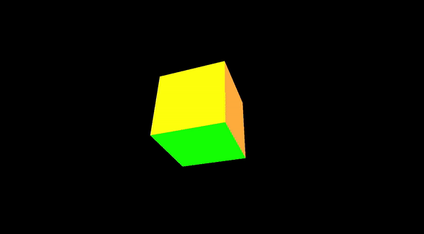

# Formas Geométricas em 3D no OpenGL

<div style="display: inline_block">
  
  
  
  
</div><br/>

## Proposta da Atividade
1. Usando o OpenGL, gere a visualização das seguintes figura geométricas em 3D.
   - Cubo
   - Esfera
2. Implemente um sistema de visualização da imagem 3D gera, onde seja possível usando o mouse, teclado ou ambos:
   - Rotacionar a câmera entorno do objeto
   - Aproximar do objeto
   - Distanciar do objeto
   - Ir para direita
   - Ir para a esquerda

## Compilação e Execução

<p align="justify">

Primeiramente, realize o download do arquivo <code>projeto3d</code> disponibilizado. Em seguida, descompacte o arquivo de <code>dependencias</code> dentro da pasta do projeto para que a pasta seja integrada ao restante do projeto, assim como mostra a **Figura 1**. Por fim, para **realizar a execução** da aplicação, abra o Visual Studio 2022 em modo **Administrador** e na escolher a janela de execução como mostrado na **Figura 2**.

</p>

<div align="center">


**Figura 1**: Descompactação e integração das dependências ao projeto.
</div>

<div align="center">


**Figura 2**: Escolha da janela de execução do projeto.
</div>

## Câmera e Organização 

<p align="justify">

As criações de câmera e suas rescpectivas movimentações responsivas ao mouse e teclado foram replicadas de acordo com o exposto pelo professor em sala. Além disso, afim de tentar melhorar a organização do código, separei a "base de criação" das figuras geométricas primitivas (Cubo e Esfera) no arquivo <code>Primitivas.h</code>, que será exemplificado logo abaixo, conforme a figura aplicada.

</p>

## Cubo em 3D

<p align="justify">

Aplicando os conhecimentos aprendidos em sala, preferí organizar o código criando a seguinte função <code>desenhaCubo</code> que como o próprio nome sugere vai tratar da criação da forma geométrica de um cubo em 3D.

</p>

```cpp
void desenhaCubo(GLuint id, float s)
{
	float d = s / 2.0;

	vec3 v1(-d, d, d);
	vec3 v2(-d, -d, d);
	vec3 v3(d, -d, d);
	vec3 v4(d, d, d);

	vec3 v5(d, d, -d);
	vec3 v6(d, -d, -d);
	vec3 v7(-d, -d, -d);
	vec3 v8(-d, d, -d);


	glNewList(id, GL_COMPILE);
	glPolygonMode(GL_FRONT_AND_BACK, GL_FILL);
	// frente
	rect(v1, v2, v3, v4, vermelho);

	// direita
	rect(v4, v3, v6, v5, azul);

	// back
	rect(v5, v8, v7, v6, amarelo);

	//esquerda
	rect(v1, v8, v7, v2, verde);

	//topo
	rect(v1, v4, v5, v8, laranja);

	//bottom
	rect(v2, v7, v6, v3, violeta);
	glEndList();
}
```

<p align="justify">

Já na <code>main.cpp</code> para desenhar a esfera, precisamos passar os seguintes parâmetros nas funções <code>desenha</code> e <code>init(GLFWwindow* window)</code>, conforme o declarado, anteriormente, na função <code>desenhaCubo</code> do arquivo <code>Primitivas.h</code>.

</p>

<div align="center">

</div>

<p align="justify">

Logo abaixo, deixo um vídeo GIF que mostra o resultado da aplicação na criação do Cubo em 3D.

</p>

<div align="center">


**GIF** da janela do terminal onde temos nosso **Cubo 3D** sendo **distanciado** e **rotacionado**.
</div>


## Esfera em 3D

<p align="justify">

Aplicando os conhecimentos aprendidos em sala, preferí organizar o código criando a seguinte função <code>desenhaEsfera</code> que como o próprio nome sugere vai tratar da criação da forma geométrica de uma esfera em 3D.

</p>

```cpp
void desenhaEsfera(unsigned int& id, color cor, GLfloat raio, GLuint nStacks, GLuint nSectors)
{
	std::vector< std::vector<GLuint> > indices;

	std::vector<vec3> pontos;
	const GLfloat PI = 3.14159265359;

	GLfloat deltaPhi = PI / nStacks;
	GLfloat deltaTheta = 2 * PI / nSectors;

	for (GLuint i = 0; i <= nStacks; i++)
	{
		GLfloat phi = -PI / 2.0 + i * deltaPhi;
		GLfloat temp = raio * cos(phi);
		GLfloat y = raio * sin(phi);

		std::vector<GLuint> pt;

		for (GLuint j = 0; j < nSectors; j++)
		{
			GLfloat theta = j * deltaTheta;
			GLfloat x = temp * sin(theta);
			GLfloat z = temp * cos(theta);

			pontos.push_back(vec3(x, y, z));
			GLuint index = pontos.size() - 1;
			pt.push_back(index);
		}// next j

		indices.push_back(pt);
	}// next i

	glNewList(id, GL_COMPILE);

	glColor3fv(cor);
	glPolygonMode(GL_FRONT_AND_BACK, GL_LINE);
	glEnable(GL_CULL_FACE);
	glFrontFace(GL_CCW);
	glCullFace(GL_BACK);

	for (GLuint i = 0; i < nStacks; i++)
	{
		glBegin(GL_TRIANGLE_STRIP);

		for (GLuint j = 0; j < nSectors; j++)
		{
			GLuint index = indices[i][j];
			glVertex3fv(&pontos[index].x);
			index = indices[i + 1][j];
			glVertex3fv(&pontos[index].x);

			if (j == nSectors - 1)
			{
				index = indices[i][0];
				glVertex3fv(&pontos[index].x);
				index = indices[i + 1][0];
				glVertex3fv(&pontos[index].x);
			}
		}
		glEnd();
	}
	glDisable(GL_CULL_FACE);
	glEndList();
}
```

<p align="justify">

Já na <code>main.cpp</code> para desenhar a esfera, precisamos passar os seguintes parâmetros nas funções <code>desenha</code> e <code>init(GLFWwindow* window)</code>, conforme o declarado, anteriormente, na função <code>desenhaEsfera</code> do arquivo <code>Primitivas.h</code>.

</p>

<div align="center">

</div>

<p align="justify">

Logo abaixo, deixo um vídeo GIF que mostra o resultado da aplicação na criação da Esfera em 3D.

</p>

<div align="center">


**GIF** da janela do terminal onde temos nossa **Esfera 3D** sendo **aproximada** e **rotacionada**.
</div>
